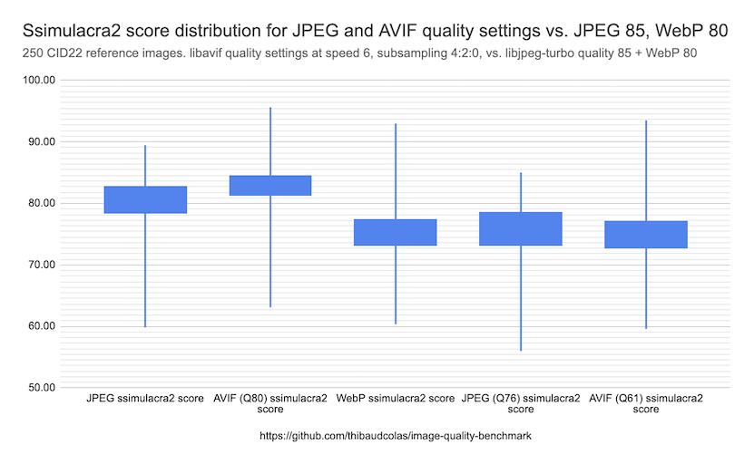

# Image quality benchmark

Somewhat-reproducible benchmarking of image quality tradeoffs between different image formats and compression levels. Created for [AVIF file sizes are consistently bigger than WEBP #13432](https://github.com/wagtail/wagtail/issues/13432) in Wagtail.

## Goal

We want to redefine Wagtail’s default AVIF quality value based on "JPEG quality 85", to offer comparable perceptual image quality at an expected lower file size.

## Results

For the 250 reference images in the [CID22 dataset](https://cloudinary.com/labs/cid22), Wagtail’s "libjpeg-turbo quality 85" encoding achieves a median ssimulacra2 score of 80.85. This is closest to libavif quality 73, at a median score of 80.80. Here are more numbers to summarize the distribution of quality scores:

| Ssimulacra2 scores | JPEG 85      | AVIF 73        | AVIF 80       | WebP           |
| ------------------ | ------------ | -------------- | ------------- | -------------- |
| Median             | 80.85 (100%) | 80.8 (-0.06%)  | 83.22 (2.93%) | 75.66 (-6.42%) |
| 25th percentile    | 78.48 (100%) | 78.92 (0.56%)  | 81.39 (3.71%) | 73.25 (-6.66%) |
| 75th percentile    | 82.69 (100%) | 82.02 (-0.81%) | 84.45 (2.12%) | 77.3 (-6.53%)  |

Here is the same distribution visualized with a box chart style candlestick chart:

View the full data in Google Sheets: [AVIF encoding quality review - Wagtail](https://docs.google.com/spreadsheets/d/19-umuXUUOAsdvtB0XXEtbOdlhQYAN3RzQ5IpByq_fec/edit?gid=422037313#gid=422037313)

Comparing file sizes with AVIF quality 80 and 73,

- AVIF quality 80 images are on average 19% smaller than JPEG quality 85
- AVIF quality 73 images are on average 31% smaller than JPEG quality 85

## Image conversion pipeline and settings

Wagtail’s image processing is done with [Willow](https://github.com/wagtail/willow), which can wrap Pillow or Wand (ImageMagick). For this benchmark, we focus on Pillow, as it is the default and most commonly used backend. With Pillow, Wagtail’s image format settings are:

- libjpeg-turbo quality 85 for JPEG
- libavif quality 80 [subsampling 4:2:0 speed 6](https://github.com/python-pillow/Pillow/blob/b0a5bc2a6b9842648727f8db99ca5c9ee8126779/src/PIL/AvifImagePlugin.py#L164-L165) for AVIF.

Relevant code to understand exactly how configuration is set:

- [Pillow AVIF: PIL/AvifImagePlugin.py](https://github.com/python-pillow/Pillow/blob/b0a5bc2a6b9842648727f8db99ca5c9ee8126779/src/PIL/AvifImagePlugin.py#L158-L165)
- [Pillow JPEG: PIL/JpegImagePlugin.py](https://github.com/python-pillow/Pillow/blob/b0a5bc2a6b9842648727f8db99ca5c9ee8126779/src/PIL/JpegImagePlugin.py#L671-L707)
- [Willow AVIF: willow/plugins/pillow.py](https://github.com/wagtail/Willow/blob/2b0f2e075e2517d323b51b250f08450132d4a8a4/willow/plugins/pillow.py#L433-L441)
- [Willow JPEG: willow/plugins/pillow.py](https://github.com/wagtail/Willow/blob/2b0f2e075e2517d323b51b250f08450132d4a8a4/willow/plugins/pillow.py#L231-L269)

## References

### Datasets

[How to compare images fairly](https://kornel.ski/en/faircomparison) is a great read. There are a lot of datasets in the space of image format benchmarking, and benchmarking of perceptual image quality measurement tools / metrics. Picking the right dataset based on the needs of your project is essential.

For Wagtail-related comparisons, the [Cloudinary Image Dataset ’22 (CID22)](https://cloudinary.com/labs/cid22) seems like a good pick. It contains a good number of images (250, 49 in the validation set), with a broad variety of content. All images are 512x512, which is relatively comparable to image sizes in Wagtail (which range from thumbnails to 1920x1080).

Here is a collage of the CID22 to get an understanding of the kinds of images it contains and their distribution:

Other datasets:

- [CLIC (Challenge on Learned Image Compression)](https://clic2025.compression.cc/) (hard to find and understand)
- [Eclipseo / Wikimedia subset1](https://github.com/eclipseo/eclipseo.github.io) (poor traceability, small size)
- [Noto Emoji](https://storage.googleapis.com/avif-comparison/noto-emoji.html) (too specific so would need combining with another dataset)
- [Kodak](https://r0k.us/graphics/kodak/) (no computer graphics, would need combining with another dataset)

### Image quality metrics

- [ssimulacra2](https://github.com/cloudinary/ssimulacra2)

### Other resources

- [Contemplating Codec Comparisons - Cloudinary](https://cloudinary.com/blog/contemplating-codec-comparisons)
- [Image format comparisons - WebM Project](https://storage.googleapis.com/demos.webmproject.org/webp/cmp/index.html#comparisons)
- [yolo-octo-bugfices comparison UI](https://xooyoozoo.github.io/yolo-octo-bugfixes/#vintage-car&jpg=s&bpg=s) based on the [Daala image format comparison tool](https://people.xiph.org/~xiphmont/demo/daala/update1-tool2b.shtml)
- [Pacidus/press_it: A tool to compress images with differents formats targeting a perceptual quality.](https://github.com/Pacidus/press_it)
